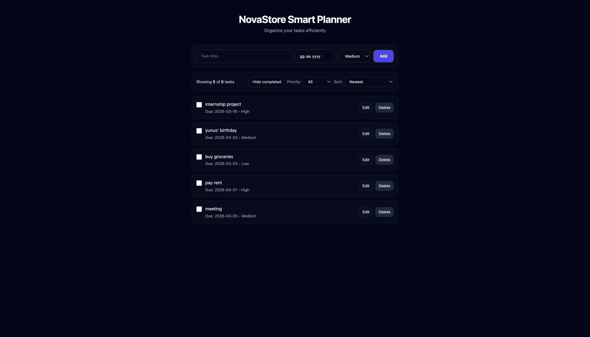

Şu an README yanlış olmuş 😄

İçine sadece şu yazı girmiş:

```
git add README.md git commit -m "Update README for submission" git push
```

Yani komutları README’nin içine yapıştırmışsın.

Sorun değil, şimdi düzgün şekilde düzeltelim 👇

---

# Doğru Şekilde README Güncelleme

1. GitHub’da `README.md` dosyasına gir
2. Sağ üstte **✏️ Edit (kalem)** ikonuna bas
3. İçindeki her şeyi sil
4. Aşağıdaki içeriğin TAMAMINI yapıştır

---

## Yapıştırılacak Doğru README İçeriği

```md
# NovaStore Smart Planner ✅

A modern task manager built with **React + Vite + TailwindCSS**.

Users can create tasks with due dates and priority levels, edit them through a modal interface, filter and sort tasks, and keep everything saved using LocalStorage.

---

## 🌐 Live Demo
https://shiny-travesseiro-461fc6.netlify.app/

---

## 🚀 Features

- Add new tasks
- Edit tasks (modal popup)
- Delete tasks
- Mark tasks as completed
- Hide completed tasks
- Filter by priority (Low / Medium / High)
- Sort tasks
- Persistent storage via LocalStorage

---

## 🛠️ Technologies Used

- React (Vite)
- TailwindCSS
- JavaScript (ES6+)
- Netlify (Deployment)

---

## 📁 Project Structure

```

src/
components/
pages/
interfaces/
App.jsx
main.jsx

````

---

## 📸 Screenshot



---

## 📦 Installation (Local Development)

```bash
git clone https://github.com/yunusemreozturkk/novastore-smart-planner.git
cd novastore-smart-planner
npm install
npm run dev
````

---

## 🏁 Build

```bash
npm run build
npm run preview
```

---

## 📌 Project Purpose

This project was developed as part of a Web Development / JavaScript training program to demonstrate:

* Modern JavaScript usage
* React component structure
* CRUD operations
* CSS framework integration
* GitHub project management
* Netlify deployment

```

---

